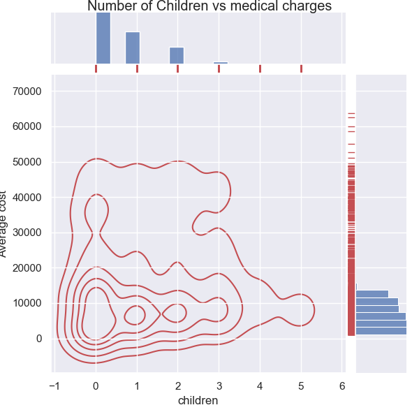

# Group 08 - Healthy Body, Healthy Money

## Milestones

Details for Milestone are available on Canvas (left sidebar, Course Project).

## Describe your topic/interest

Through this project, we hope to raise awareness and promote a healthy lifestyle by showcasing the underlying factors of high healthcare charges in the US. We are living in a generation where technology is advancing rapidly which may lead to an unhealthy lifestyle due to many causes such as office syndrome. We feel like this topic should be explored in order to raise the awareness of society on the effects of unhealthy lifestyle. To support our goal, we will investigate the relationship between lifestyle variables such as age, BMI, and smoking habit with healthcare cost. As most of our variables are quantitative, different types of graphs such as scatter plots, bar graphs, and pie charts can be made. This means that building a user-facing dashboard is very viable using the datasets and research questions that we have. An example of this implementation would be to visualize how an increase in a variable (i.e. BMI) affect healthcare costs using a dynamic scatter plot. We believe that these and other supporting visualizations and information will be very beneficial for the audience to understand the impact of unhealthy lifestyle towards their medical bill.

## Describe your dataset

Our main dataset which is the Medical Cost Personal Datasets was taken from Kaggle. The provider took it from a GitHub user containing all datasets included in the Machine Learning with R book by Brett Lantz. The dataset contains 7 columns - age, sex, BMI, children, smoker, region and charges. The purpose of this dataset is for users (or people who are studying the book) to be able to test their knowledge of machine learning and use the dataset to predict or answer different research questions. The supporting dataset which is the Adult Census Income was extracted from the 1994 Census bureau database by Ronny Kohavi and Barry Becker. It is published on Kaggle with the public domain license. The dataset contains 15 columns - age, workclass, fnlwgt (final weight), education, education.num, marital.status, occupation, relationship, race, sex, capital.gain, capital.loss, hours.per.week, native.country, and income. Some of the rows contain empty data which means that data cleaning is necessary to use this data. The initial purpose of this dataset is to predict whether income exceeds $50K/yr based on census data. The data was initially collected by the United States Census Bureau in 1994.

## Team Members

- Amie Prasongsukarn: Third year, Data Science major at UBCO
- Jason Samuel Suwito:  Third year, Data Science major at UBCO
- Kenneth Abadi: Second year, Computer Science major at UBCO

## Images

## References
Main dataset: https://www.kaggle.com/datasets/mirichoi0218/insurance

Supporting dataset: https://www.kaggle.com/datasets/uciml/adult-census-income
