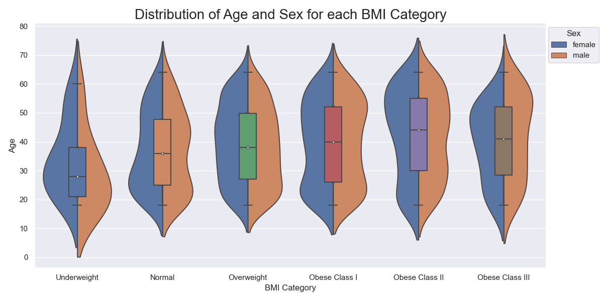
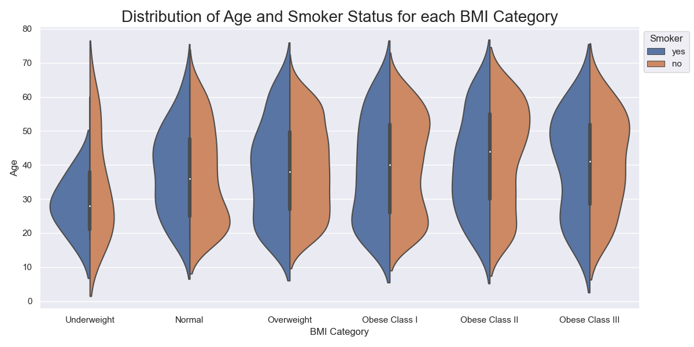
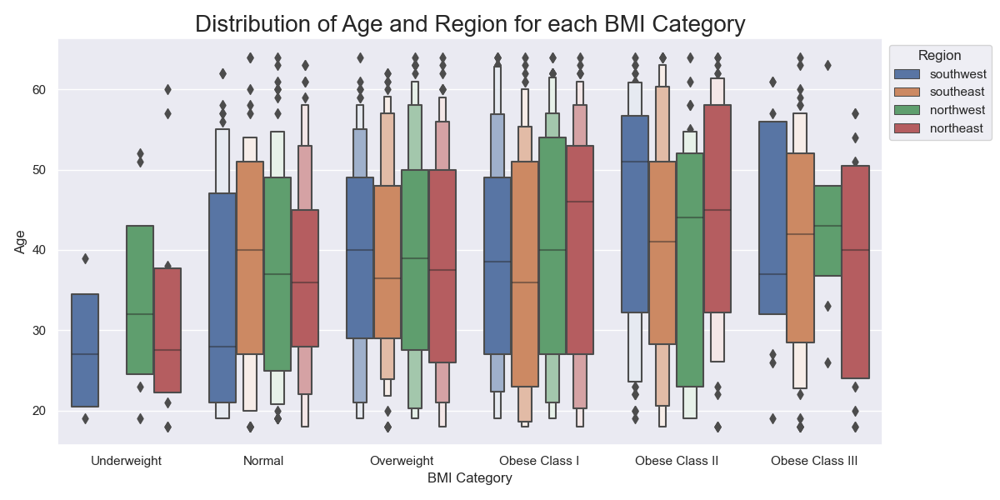

# Introduction 
Through this project, we hope to raise awareness and promote a healthy lifestyle by showcasing the underlying factors of high healthcare charges in the US. We are living in a generation where technology is advancing rapidly which may lead to an unhealthy lifestyle due to many causes such as office syndrome. We feel like this topic should be explored in order to raise the awareness of society on the effects of unhealthy lifestyle. To support our goal, we will investigate the relationship between lifestyle variables such as age, BMI, and smoking habit with healthcare cost. As most of our variables are quantitative, different types of graphs such as scatter plots, bar graphs, and pie charts can be made. This means that building a user-facing dashboard is very viable using the datasets and research questions that we have. An example of this implementation would be to visualize how an increase in a variable (i.e. BMI) affect healthcare costs using a dynamic scatter plot. We believe that these and other supporting visualizations and information will be very beneficial for the audience to understand the impact of unhealthy lifestyle towards their medical bill.

 

# Exploratory Data Analysis
The main dataset we are analyzing is the Medical Cost Personal Datasets was taken from Kaggle. The dataset contains 7 columns - age, sex, BMI, children, smoker, region and charges. The supporting dataset we used is the Adult Census Income; the dataset contains 15 columns - age, workclass, fnlwgt (final weight), education, education.num, marital.status, occupation, relationship, race, sex, capital.gain, capital.loss, hours.per.week, native.country, and income. With these, we were able to create different visualizations that helped us produce insightful analysis for our research questions.

## Question 1 + Results 
**What are the average healthcare costs for different ages?**
 
Since this is a barplot it is hard to see the trend between age group and average healthcare cost. However, by eye, we can see an overall positive trend if we compare the peaks of the barcharts for all ages. But the bar plot is useful as we are able to see some bars where the average cost increases a lot or decreases a lot. For example, from age 37 to age 38, the average cost drops by nearly $10,000. However, because we aren't able to look into the sample for age 37, we don't know why the average medical cost for that group is so high.

From Tableau, we are able to confirm our insights of an overall positive trend between Age and average medical cost. As shown through the statistical summary tab, the R-squared value is 0.7 which shows a strong positive correlation between both factors. Thus, as predicted, as we get older, it is possible for the average cost to get higher because older people are prone to more diseases.

 

## Question 2 + Results 
**How does age is distributed in each BMI Classifications?**

Overall, it can be seen that there is a shift on the peak of the age distribution as the BMI Category progresses from Underweight to Obese Class II. This finding is supported by the median line of the box and whisker plot which shows that there is a shift in the age median as the BMI Category progresses from Underweight to Obese Class II. Thus, there may be a positive linear relationship between Age and BMI which implies that as age increases, BMI also increases. Looking at the sex hue, there is a slight difference on the distribution of age in each BMI category between female and male. For instance, in the underweight classification, Male tend to be younger compared to female. In the Obsese Class III classification, Male tend to be older compared to female. This shows that sex does affect the distribution of age for each BMI category.

Looking at the smoker status hue, there is a slight difference on the distribution of age in each BMI category between smokers and non smokers. Non-smokers tend to have a positive shift in the distribution of age as the BMI category progresses. This implies that non-smokers follows the positive linear trend between age and BMI. However, for smokers, there is no observed pattern on the shift of age distribution in each BMI category. Thus smoker's status does affect the distribution of age in each BMI category.

Looking at the Region hue, there is a difference on the distribution of age in each BMI category between the four regions in the United States. Since there is no data for the underweight BMI category in the southeast region, that category will be excluded from this sub question analysis. There is no pattern that can be observed for the distribution of age and BMI category in the southern regions. However, in the northern regions, there is an positive shift in the age distribution as the BMI category progresses. Furthermore, it is observed that each region does have a different age distribution for each BMI category. Thus, region does affect the distribution of age for each BMI category.

 

## Question 3 + Results 
**What is the correlation between BMI and Medical Charges for smokers and non-smokers**

From the two scatterplots above, we can see that between BMI and Charges, the smoker graph has a very strong positive correlation (0.806) with the there being two major density 'blocks' seen.
the non-smoker graph (0.084) has a very weak or no correlation where the plots are very concentrated under $15000 charges and across the whole range of the BMI. The results could be due to smoking increases the severity and health risks associated with higher BMI's
 

Further exploring this research question, i decided to see whether or not the correlation is the same within all the regions by checking the number of smokers in each region, their average BMI's and also the average charges.

Southeast (33.4) and Southwest (30.6) regions both have higher average BMI's as compared to the northeast (29.17) and northwest (29.19) regions. The trend continues for the southeast region where they have the highest average medical charges (14735) and the southwest region having the lowest medical average charges (12346). It seems like the medical cost do follow the hypothesis where the larger number of smokers in a population increases medical charges but the same does not apply to BMI where the southern regions have a higher average BMI as compared to the northern regions.

 

# Summary/Conclusion 
After researching, it is clear that there are many factors of high healthcare charges. In addition, most of these factors are related to each other causing some factors to be more significant once analyzed against other factors. From the plots shown throughout, we can see that age is a significant factor towards high healthcare charges because as we get older, we are prone to more diseases. Whilst bmi becomes more significant once we separate it into smokers and non-smokers and thus showing that smokers are more likely exposed to health risks which causes healthcare charges to be higher than non-smokers. Through this project, we learnt to use pandas and data visualization tools to create insightful analysis.