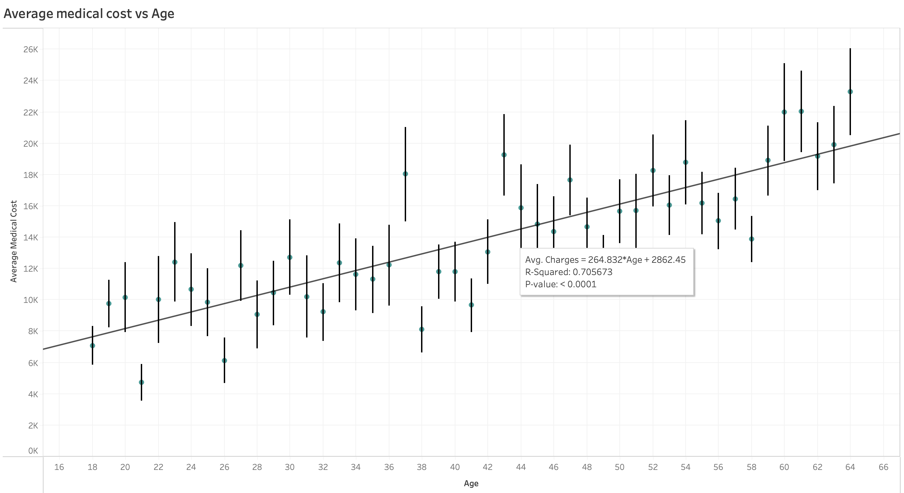

# Introduction 
A short paragraph introducing your project to the audience and a motivation for why this project is important. It’s fine to say your group has an interest in this topic and were keen to explore it more.

Through this project, we hope to raise awareness and promote a healthy lifestyle by showcasing the underlying factors of high healthcare charges in the US. We are living in a generation where technology is advancing rapidly which may lead to an unhealthy lifestyle due to many causes such as office syndrome. We feel like this topic should be explored in order to raise the awareness of society on the effects of unhealthy lifestyle. To support our goal, we will investigate the relationship between lifestyle variables such as age, BMI, and smoking habit with healthcare cost. As most of our variables are quantitative, different types of graphs such as scatter plots, bar graphs, and pie charts can be made. This means that building a user-facing dashboard is very viable using the datasets and research questions that we have. An example of this implementation would be to visualize how an increase in a variable (i.e. BMI) affect healthcare costs using a dynamic scatter plot. We believe that these and other supporting visualizations and information will be very beneficial for the audience to understand the impact of unhealthy lifestyle towards their medical bill.

# Exploratory Data Analysis 
A summary of the highlights of your EDA, where you can show some visualizations of the exploratory data analysis your group did.

# Question 1 + Results 
Clearly state your research question, and include 2-3 visualizations that helped you answer your research question. You can create multi-panel figures, but each of your visualizations must speak directly to your research question, and any insights you were able to get from it should be clearly articulated in the figure caption/description.

**What are the average healthcare costs for different age groups?**
 
Since this is a barplot it is hard to see the trend between age group and average healthcare cost. However, by eye, we can see an overall positive trend if we compare the peaks of the barcharts for all ages. But the bar plot is useful as we are able to see some bars where the average cost increases a lot or decreases a lot. For example, from age 37 to age 38, the average cost drops by nearly $10,000. However, because we aren't able to look into the sample for age 37, we don't know why the average medical cost for that group is so high.

From the plot above, we can see a positive correlation between age and average cost. Though we can see that the points are quite spread out and so creating a weak positive correlation between both factors. As predicted, as we get older, it is possible for the average cost to get higher because older people are prone to more diseases.

# Question 2 + Results 
Same as above.

# Question 3 + Results 

**What is the correlation between BMI and Medical Charges for smokers and non-smokers**

From the two scatterplots above, we can see that between BMI and Charges, the smoker graph has a very strong positive correlation (0.806) with the there being two major density 'blocks' seen.
the non-smoker graph (0.084) has a very weak or no correlation where the plots are very concentrated under $15000 charges and across the whole range of the BMI. The results could be due to smoking increases the severity and health risks associated with higher BMI's

**Which region has a higher percentage of smokers? Does this highly affect the average BMI and Charges?** 

Southeast (33.4) and Southwest (30.6) regions both have higher average BMI's as compared to the northeast (29.17) and northwest (29.19) regions. The trend continues for the southeast region where they have the highest average medical charges (14735) and the southwest region having the lowest medical average charges (12346). It seems like the medical cost do follow the hypothesis where the larger number of smokers in a population increases medical charges but the same does not apply to BMI where the southern regions have a higher average BMI as compared to the northern regions.

# Summary/Conclusion 
A brief paragraph that highlights your key results and what you learned from doing this project.